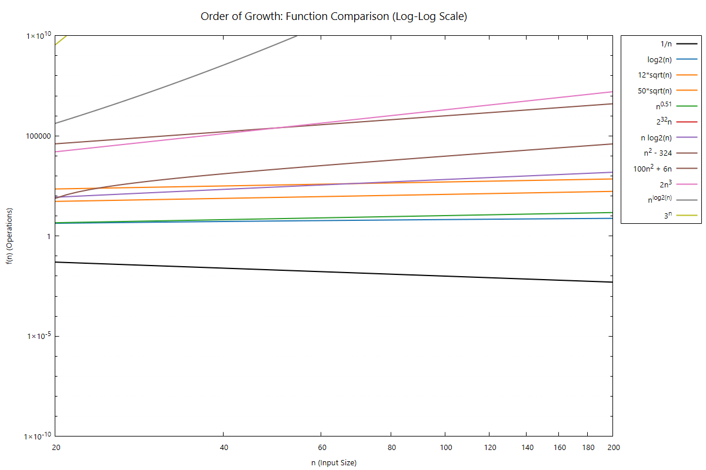

# Asymptotic Order of Growth of Functions

This document serves as a reference for analyzing the asymptotic order of growth for common mathematical functions used in complexity analysis.

##  Folder Structure
* `q1.c`: The main C source code containing the logic for calculating the function growth data.
* `a.exe`: The compiled Windows executable file generated after compiling the code.
* `growth_data.txt`: The text file automatically generated by the program to store the calculated numerical values.
* `growth_graph.png`: The final visualization of the order of growth plotted from the data.
* `README.md`: This documentation file detailing the asymptotic analysis and project instructions.

## Graph Generation

The accompanying C program automatically calculates the values for these functions and generates a visual representation saved as **`growth_graph.png`**. 

## Compilation and Execution Instructions
Open your terminal or command prompt in the folder containing your C file and run the following commands:

**1. Compile the code:**
*(Note: The `-lm` flag is required on Linux/macOS to link the math library)*
```bash
gcc -o plot_growth q1.c -lm
```
## The Ranked Functions

When analyzing algorithms, constants and lower-order terms are eventually dominated by the highest-order term. Placed in **decreasing order of growth** (using chained inequality symbols), the functions are ranked as follows:

$$3^n > n^{\log_2 n} > 2n^3 > 100n^2 + 6n > n^2 - 324 > n \log_2 n > 2^{32}n > n^{0.51} > 50n^{0.5} > 12\sqrt{n} > \log_2 n > \frac{1}{n}$$

---



### The Visualization Problem

As you might notice when attempting to graph these equations, we are unable to visualize them properly all at once. Because some functions grow explosively fast (like $3^n$) and others grow incredibly slowly (like $\log_2 n$ or $1/n$), they cannot be neatly represented on a standard scale. The lines either flatten out to zero or shoot instantly to infinity. To see the true mathematical ordering where every function completely separates into its correct rank, we cannot rely on small inputs; it requires a "sufficiently large" $n$.

---

## Finding the "Sufficiently Large" $n$

A common trap in complexity analysis is assuming that asymptotic dominance applies for small values of $n$. For these functions to arrange themselves *exactly* in the order listed above by their actual numerical values, $n$ must overcome several extreme constants.

Looking at the important crossing points.

### 1. The Polynomial Crossover: $50n^{0.5}$ vs $n^{0.51}$
For the slightly higher polynomial degree to overtake the larger constant:
$$50n^{0.5} < n^{0.51} \implies 50 < n^{0.01}$$
$$\implies n > 50^{100}$$
This evaluates to approximately $7.88 \times 10^{169}$, which is vastly larger than the number of atoms in the observable universe (approx. $10^{80}$). 

Here is how the values compare as $n$ approaches and passes the crossover:

| $n$ (Input Size) | $f_1(n) = 50n^{0.5}$ | $f_2(n) = n^{0.51}$ | Larger Function |
| :--- | :--- | :--- | :--- |
| $10^{10}$ | $5 \times 10^6$ | $1.25 \times 10^5$ | $f_1(n)$ |
| $10^{100}$ | $5 \times 10^{51}$ | $10^{51}$ | $f_1(n)$ |
| **$50^{100}$ (Crossover)** | $\approx 1.4 \times 10^{86}$ | $\approx 1.4 \times 10^{86}$ | **Equal** |
| $10^{175}$ | $1.58 \times 10^{89}$ | $5.6 \times 10^{89}$ | **$f_2(n)$ (Takes over)** |

### 2. The Linear vs Linearithmic Crossover: $2^{32}n$ vs $n \log_2 n$
This is the ultimate bottleneck. Because $2^{32}$ is a massive constant ($\approx 4.29 \times 10^9$), $n \log_2 n$ takes an unimaginably long time to overtake it:
$$2^{32}n < n \log_2 n \implies 2^{32} < \log_2 n$$
$$\implies n > 2^{2^{32}} = 2^{4,294,967,296}$$

Here is how the values compare as $n$ approaches and passes the crossover:

| $n$ (Input Size) | $f_1(n) = 2^{32}n$ | $f_2(n) = n \log_2 n$ | Larger Function |
| :--- | :--- | :--- | :--- |
| $2^{10}$ | $2^{42}$ | $10 \cdot 2^{10}$ | $f_1(n)$ |
| $2^{1,000,000,000}$ | $2^{1,000,000,032}$ | $1,000,000,000 \cdot 2^{1,000,000,000}$ | $f_1(n)$ |
| **$2^{4,294,967,296}$ (Crossover)**| $2^{4,294,967,328}$ | $2^{4,294,967,328}$ | **Equal** |
| $2^{8,589,934,592}$ | $2^{8,589,934,624}$ | $2^{33} \cdot 2^{8,589,934,592}$ | **$f_2(n)$ (Takes over)** |

### Conclusion: The Ultimate Threshold
For **all** functions to simultaneously align in their true asymptotic order, $n$ must surpass the largest crossover point. 

Therefore, the functions arrange in the specified order strictly for:
$$n > 2^{4,294,967,296}$$

This threshold is a number with roughly 1.29 billion decimal digits! It perfectly illustrates why Big-O notation focuses on theoretical limits as $n \to \infty$ rather than empirical testing on small inputs.