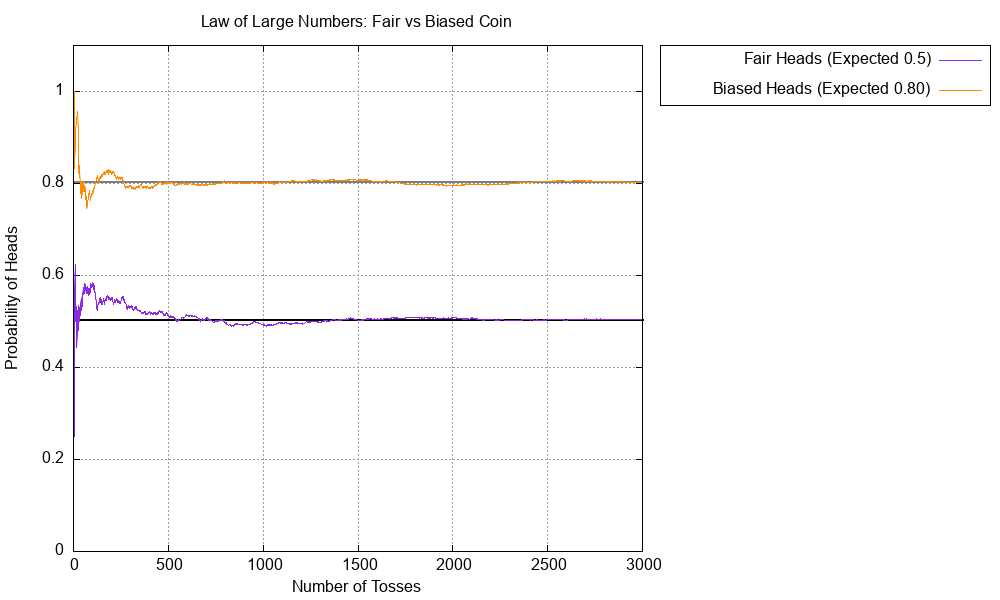

# Fair vs. Biased Coin Toss Simulator

## Overview
This project simulates coin tossing experiments in C to demonstrate the **Law of Large Numbers**. It compares the behavior of a **fair coin** (expected probability of $0.5$) against a **biased/unfair coin** (with a custom probability between $0.0$ and $1.0$) over a given number of tosses. 


## Input
The program accepts the number of tosses and the unfair probability between $0.0$ and $1.0$ as the input, and plots this graph accordingly using **Gnuplot** to visualize how the experimental probability converges to the expected value.

## Graph generation
The accompanying C program automatically calculates the probability for head for both fair and baised coins after vs the number of tosses and saves the graph as **`coin_simulation.png`**. 

## Folder Structure
* `q2.c`: The main C source code containing the simulation logic.
* `a.exe`: The compiled Windows executable file generated after running the code.
* `line_graph_data.txt`: The text file automatically generated by the program to store the toss-by-toss probability data.
* `coin_simulation.png`: The final line graph plotted by Gnuplot.
* `README.md`: This documentation file detailing the project.

##  Example Output Graph

Below is a preview of the generated simulation graph (`coin_simulation.png`) comparing the fair coin and the biased coin:



###  Graph Analysis: The Law of Large Numbers
By analyzing the graph, we can see a perfect visual representation of the **Law of Large Numbers**:
* **Small number of tosses (small $n$)**: At the beginning of the graph, the lines are highly erratic and fluctuate randomly. With only a few coin flips, the outcomes are unpredictable and the calculated probability jumps around.
* **Large number of tosses (large $n$)**: As the number of tosses ($n$) grows, the wild fluctuations smooth out. The experimental probability eventually stabilizes and tends directly towards the mathematical/theoretical probability (the flat reference lines at $0.5$ and your chosen biased probability). 

---

## Compilation and Execution Instructions
Open your terminal or command prompt in the folder containing your C file and run the following commands:

**1. Compile the code:**
*(Note: The `-lm` flag is required on Linux/macOS to link the math library)*
```bash
gcc -o coin_simulator q2.c -lm
```