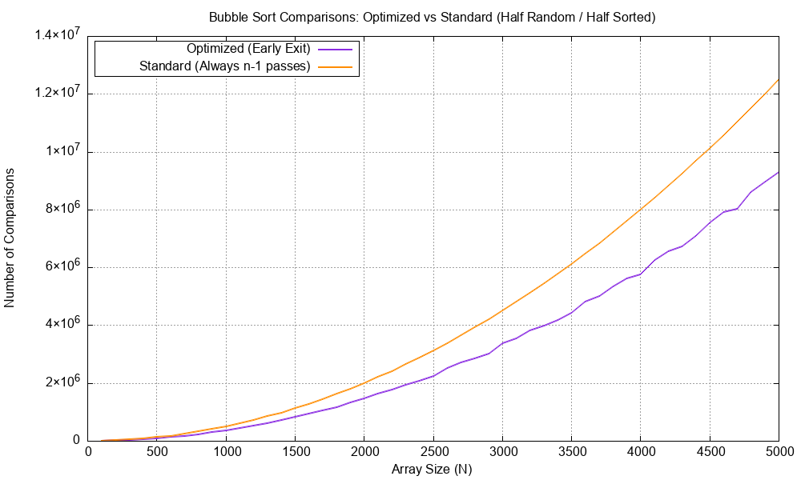

# Bubble Sort Performance Analysis

This C program designed to simulate and compare the efficiency of two different variations of the Bubble Sort algorithm. 

## Folder Structure
* `q3.c`: The main C source code containing the bubble sort simulation logic.* `
* `a.exe`: The compiled Windows executable file generated after compiling the code.
* `bubble_sort_comparison.png`: The final line graph plotted by Gnuplot comparing the performance of both algorithms.
* `README.md`: This documentation file detailing the project and analysis.

##  What the Program Does

The provided C program automatically tests, records, and visualizes the number of comparisons made by both algorithms. 

### 1. The Algorithms
*   **Optimized Bubble Sort (Early Exit):** Uses a boolean `swap` flag. If a full pass is completed through the array without making a single swap, the algorithm recognizes that the array is already sorted and terminates immediately.
*   **Standard Bubble Sort:** Blindly executes all $n-1$ passes regardless of the array's actual state.

### 2. The Data Generation Strategy
To effectively demonstrate the difference between these two versions, the program tests arrays ranging in size from $N = 100$ to $N = 5000$ (in increments of 100). 
Instead of a purely random array (where early exit rarely triggers until the very end), the script generates a "Half Random / Half Sorted" array:
*   **First Half:** Randomized integers.
*   **Second Half:** Strictly sorted integers that are guaranteed to be greater than the maximum value of the first half. 

This specific data structure ensures that the optimized sort will trigger its early exit condition much faster, highlighting its algorithmic advantage over the standard version.

### 3. Automated Graphing
The C program tracks the number of `>` comparisons for both algorithms. It writes this data to a temporary file (`bubble_data.txt`) and dynamically invokes **Gnuplot** to generate a PNG graph comparing the results.

---

##  Graph Analysis



The generated graph plots the **Array Size ($N$)** on the X-axis and the **Number of Comparisons** on the Y-axis. 

**Key Takeaways from the Graph:**
*   **Standard Sort (Orange Line):** Follows a perfect, smooth quadratic curve. Because it never exits early, its comparison count is strictly deterministic and follows the exact formula for standard bubble sort comparisons: $\frac{n(n-1)}{2}$. For an array of size 5000, it performs approximately $1.25 \times 10^7$ comparisons.
*   **Optimized Sort (Purple Line):** Also exhibits an $O(n^2)$ growth rate, but the curve is significantly lower. Because the second half of the array is already sorted, the algorithm terminates early, drastically reducing wasted comparisons. 
*   **The Jagged Curve:** You will notice the purple line is slightly jagged or "bumpy". This perfectly reflects the random nature of the first half of the data; depending on how chaotic the random numbers are generated for a specific size $N$, the algorithm might need a few more or a few fewer passes before the `swap` flag remains false.

---

### Data Comparison Table
The table below illustrates the exact deterministic comparisons for the Standard sort versus the expected (approximate) comparisons for the Optimized sort given the "Half Random / Half Sorted" data structure. Because the first half is random, the Optimized values fluctuate slightly around a mathematical average of roughly $\frac{3N^2}{8}$.

| Array Size ($N$) | Standard Sort Comparisons (Exact) | Optimized Sort Comparisons (Approximate) |
| :--- | :--- | :--- |
| 10 | 45 | ~37 |
| 100 | 4,950 | ~3,750 |
| 1,000 | 499,500 | ~375,000 |
| 5,000 | 12,497,500 | ~9,375,000 |

---


## Compilation and Execution Instructions
Open your terminal or command prompt in the folder containing your C file and run the following commands:

**1. Compile the code:**
*(Note: The `-lm` flag is required on Linux/macOS to link the math library)*
```bash
gcc -o bubble_sort_comparison q3.c -lm
```