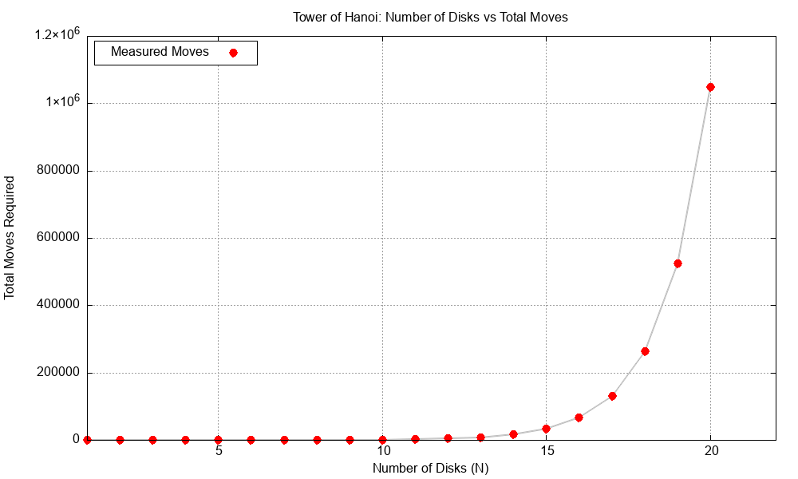

# Tower of Hanoi: Simulation and Complexity Analysis

This C program that simulates the classic Tower of Hanoi mathematical puzzle, tracks the number of moves required to solve it for varying numbers of disks, and generates a visual plot of the data to analyze its algorithmic efficiency.

##  Folder Structure
* `q4.c`: The main C source code containing the recursive Tower of Hanoi simulation logic.
* `a.exe`: The compiled Windows executable file generated after compiling the code.
* `toh_data.txt`: The temporary text file automatically generated by the program to store the calculated number of moves for each $n$.
* `toh_plot.png`: The final visualization of the exponential growth plotted by Gnuplot.
* `README.md`: This documentation file detailing the algorithmic analysis and project instructions.

---


## How the Program Works

The C program accomplishes the task in three main steps:
1.  **Recursive Simulation:** It uses a recursive function `toh()` to simulate the exact movements required to shift $n$ disks from the source peg to the destination peg using an auxiliary peg. 
2.  **Data Collection:** Instead of printing every single move to the console (which would crash or freeze the terminal for large $n$), it uses a pointer to a `long long` counter to tally the exact number of moves. It evaluates this for $n = 1$ up to $n = 20$ disks and writes the results to a temporary file (`toh_data.txt`).
3. **Graph generation:** The C program creates a png file for the number of steps required for n number of discs for $n <= 20$
---

## Graph Analysis



The generated graph plots the **Number of Disks (N)** on the X-axis against the **Total Moves Required** on the Y-axis. 

**Key Visual Observations:**
*   **Deceptive Start:** For small values of $N$ (from 1 to about 10), the number of moves seems practically zero on this scale, giving the illusion of a highly efficient algorithm.
*   **The Explosive Spike:** Around $N = 15$, the curve begins to shoot upward aggressively. By the time it reaches $N = 20$, the algorithm requires over $1,000,000$ operations (specifically $1,048,575$ moves) to complete the task. 

---

### Number of Moves per Disk ($n$)
The table below details the exact number of moves required for each disk count from $n = 1$ to $20$, calculated using the formula $2^n - 1$:

| Number of Disks ($n$) | Total Moves Required ($2^n - 1$) |
| :--- | :--- |
| 1 | 1 |
| 2 | 3 |
| 3 | 7 |
| 4 | 15 |
| 5 | 31 |
| 6 | 63 |
| 7 | 127 |
| 8 | 255 |
| 9 | 511 |
| 10 | 1,023 |
| 11 | 2,047 |
| 12 | 4,095 |
| 13 | 8,191 |
| 14 | 16,383 |
| 15 | 32,767 |
| 16 | 65,535 |
| 17 | 131,071 |
| 18 | 262,143 |
| 19 | 524,287 |
| 20 | 1,048,575 |

##  Conclusion: What Does the Plot Tell Us?

Based on the plot obtained, we can make a definitive conclusion about the algorithm's performance: **The Tower of Hanoi algorithm exhibits an exponential time complexity of $O(2^n)$.**

### The Mathematical Breakdown
For every new disk added, the algorithm must:
1. Move the top $n-1$ disks out of the way.
2. Move the largest $n^{th}$ disk to the destination.
3. Move the $n-1$ disks back on top of the largest disk.

This results in the recurrence relation: $M(n) = 2M(n-1) + 1$.
Solving this yields the exact formula for the number of moves:
$$M(n) = 2^n - 1$$

### Final Verdict
The graph perfectly visualizes this $2^n$ exponential growth. We can conclude that while this recursive algorithm is mathematically elegant and functionally correct, it is highly **inefficient and completely non-scalable** for large datasets. If we were to attempt $N = 64$ (as the original Tower of Brahma legend suggests), it would take $2^{64} - 1$ moves. Even at one billion moves per second, it would take the computer roughly 585 billion years to finish!

---

##  Compilation & Execution

**1. Compile the code:**
```bash
gcc -o toh_sim q4.c