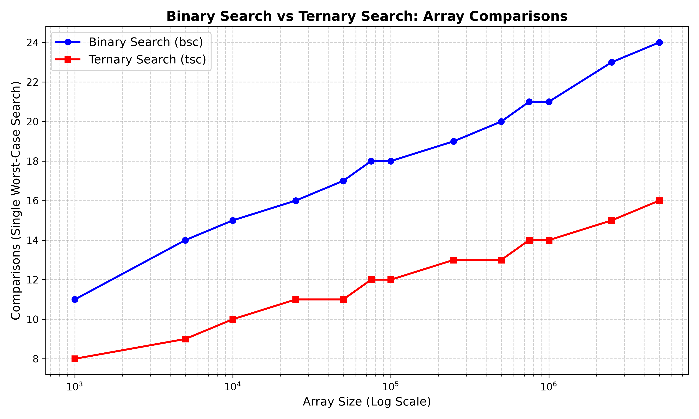

# Binary Search vs Ternary Search Analysis

## Directory Structure
The project files are organized as shown in the directory tree below:

```text
Question_1/
├── a.exe
├── comparisons_plot.png
├── q1.c
├── q1plot.py
├── README.md
└── results.csv
```

---

## How the Algorithms Work

### Binary Search
Binary Search works by applying a divide-and-conquer strategy on a sorted array. It finds the middle element and compares it to the target. 
* If the target is less than the middle element, it recursively searches the left half.
* If the target is greater than or equal to the middle element, it recursively searches the right half.
* The search space is divided into 2 equal parts at every step.

### Ternary Search
Ternary Search uses a similar divide-and-conquer approach but divides the sorted array into 3 equal parts using two midpoints (`mid1` and `mid2`).
* It first checks if the target is in the first third (before `mid1`).
* If not, it checks if the target is in the second third (between `mid1` and `mid2`).
* If not, it assumes the target is in the final third (after `mid2`).
* The search space is divided into 3 equal parts at every step.

---

## Graphical Results

Below is the plotted graph generated by the Python script, visually confirming that Ternary Search makes more comparisons than Binary Search across all array sizes.



---

## Time Complexity (TC) and the Mathematical Proof

The core misconception is that Ternary Search should be faster because it reduces the search space faster ($n/3$ vs $n/2$). Let us break down the mathematical proof.

### 1. Depth of the Search Tree
The maximum number of recursive steps (depth) depends on the base of the logarithm:
* **Binary Search Depth:** $\log_2 n$
* **Ternary Search Depth:** $\log_3 n$

To compare them, we can convert the base of the Ternary Search logarithm to base 2:
$$ \log_3 n = \frac{\log_2 n}{\log_2 3} $$

Since $\log_2 3 \approx 1.585$ (which is roughly 1.6), we can rewrite this as:
$$ \log_2 n \approx 1.585 \times \log_3 n $$

This means **Binary Search takes about 1.6 times more steps/splits than Ternary Search**. 

### 2. Number of Comparisons (Why Binary Search is Faster)
While Ternary Search has fewer steps, we must count the **comparisons made per step** in the worst-case scenario.

Looking at the provided C code logic:
* **Binary Search** makes exactly $1$ comparison per recursive step (`if (arr[m] >= x)`).
  Total worst-case comparisons = $1 \times \log_2 n$
* **Ternary Search** makes up to $2$ comparisons per recursive step (`if (arr[mid1] >= x)` and `if (arr[mid2] >= x)`).
  Total worst-case comparisons = $2 \times \log_3 n$

Substitute the logarithm base from our earlier proof into the Ternary Search comparisons:
$$ 2 \times \log_3 n = 2 \times \left( \frac{\log_2 n}{1.585} \right) \approx 1.26 \times \log_2 n $$

**Conclusion:** Even though Ternary Search has fewer splits, doing two comparisons per split results in approximately **26% more comparisons** overall in the worst case ($1.26 \times \log_2 n$ compared to $1.0 \times \log_2 n$). This makes Binary Search mathematically more efficient.

---

## Experimental Setup and Automation

To practically prove the mathematical analysis above, this project implements an automated testing pipeline:

1. **C Program (`q1.c`):** 
   * Iterates through a defined set of array sizes ranging from 1,000 to 5,000,000 elements.
   * For each size, it allocates an array and executes a worst-case search by looking for a target that does not exist in the array (`-1`).
   * It increments global counters (`bsc` and `tsc`) for every comparison made.
   * The results for each array size are written directly into `results.csv`.

2. **Python Script (`q1plot.py`):**
   * Reads the `results.csv` data.
   * Uses `matplotlib` to plot the total comparisons on a logarithmic scale.
   * Saves the final visual proof to `comparisons_plot.png`, clearly demonstrating the $1.26$ overhead of Ternary Search over Binary Search as the array size scales.

### Execution

```bash
gcc q1.c -o a.exe && ./a.exe && python q1plot.py
```